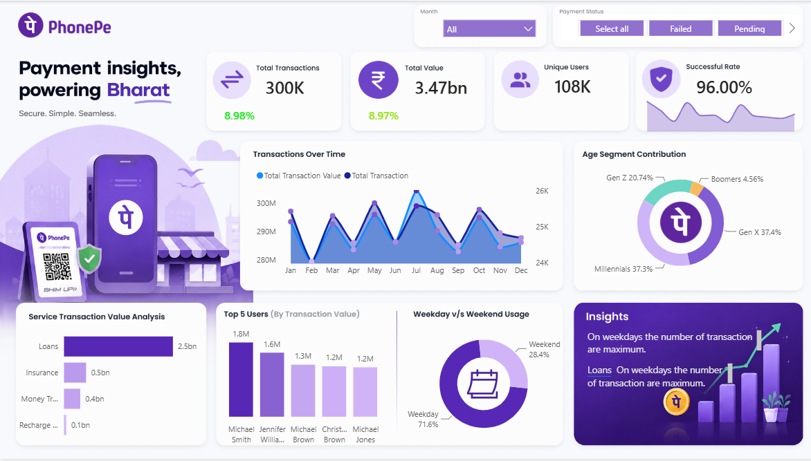

# 📱 PhonePe Transaction Insights Dashboard | Power BI

An interactive **Power BI dashboard** built to analyze PhonePe digital payment transactions. This project provides actionable business insights by tracking transaction volume, transaction value, payment success rate, customer demographics, service-wise performance, and user behavior.

---

## 📑 Table of Contents

- [Overview](#-overview)
- [Business Problem](#-business-problem)
- [Project Objectives](#-project-objectives)
- [Dataset Overview](#-dataset-overview)
- [Data Model](#-data-model)
- [Dashboard Features](#-dashboard-features)
- [KPIs](#-kpis)
- [Visualizations Used](#-visualizations-used)
- [Business Insights](#-business-insights)
- [Business Recommendations](#-business-recommendations)
- [Tools & Technologies](#-tools--technologies)
- [DAX Measures](#-dax-measures)
- [Project Structure](#-project-structure)
- [Dashboard Screenshot](#-dashboard-screenshot)
- [Future Enhancements](#-future-enhancements)
- [Author](#-author)

---

# 📌 Overview

The **PhonePe Transaction Insights Dashboard** is a Business Intelligence project developed in **Power BI** to monitor digital payment performance. The dashboard enables businesses to analyze transaction trends, payment success rates, customer segments, service performance, and user activity using interactive visualizations.

---

# 💼 Business Problem

Digital payment platforms generate millions of transactions daily. Business teams need a centralized dashboard to:

- Monitor transaction growth
- Track payment success rate
- Analyze customer behavior
- Identify high-value services
- Compare weekday and weekend usage
- Monitor payment failures
- Support data-driven business decisions

---

# 🎯 Project Objectives

- Analyze total transactions and transaction value.
- Measure payment success rate.
- Monitor month-over-month growth.
- Identify top users by transaction value.
- Analyze age-wise customer contribution.
- Compare weekday vs weekend usage.
- Evaluate service-wise transaction performance.
- Build an interactive dashboard for business stakeholders.

---

# 📂 Dataset Overview

The project contains three datasets.

## 1. All_Transactions

| Column |
|---------|
| Transaction_ID |
| User_ID |
| Amount |
| Date |
| Payment_Status |
| Service |
| Service Type |
| Reason |

---

## 2. All_Users

| Column |
|---------|
| User_ID |
| Name |
| Age |
| Age Segment |
| Join_Date |

---

## 3. Date_Table

Used for Time Intelligence calculations.

Contains:

- Date
- Month
- Quarter
- Year
- Weekday
- Weekend

---

# 🗂 Data Model

The dashboard follows a **Star Schema**.

```
                Date_Table
                    │
                    │
All_Users ───── All_Transactions
```

Relationships:

- User_ID
- Date

---

# 📊 Dashboard Features

✔ Interactive KPI Cards

✔ Month Filter

✔ Payment Status Filter

✔ Time Intelligence Analysis

✔ Service-wise Analysis

✔ Customer Segmentation

✔ Transaction Trend Analysis

✔ Weekday vs Weekend Comparison

✔ Top Customer Analysis

---

# 📈 KPIs

| KPI | Value |
|------|--------|
| Total Transactions | 300K |
| Total Transaction Value | ₹3.47 Billion |
| Unique Users | 108K |
| Success Rate | 96% |

---

# 📉 Visualizations Used

| Visualization | Purpose |
|--------------|----------|
| KPI Cards | Display overall business metrics |
| Area + Line Chart | Monthly transaction trend |
| Donut Chart | Age segment contribution |
| Horizontal Bar Chart | Service-wise transaction value |
| Column Chart | Top 5 users by transaction value |
| Donut Chart | Weekday vs Weekend comparison |
| Slicers | Month & Payment Status filtering |

---

# 📊 Business Insights

### 📌 Transaction Growth

- Total transactions reached **300K**.
- Transaction volume increased by approximately **9%**.

---

### 📌 Payment Success

- Success Rate is **96%**.
- Indicates a highly reliable payment system.

---

### 📌 Customer Demographics

- Millennials contribute **37.3%**
- Gen X contributes **37.4%**
- Gen Z contributes **20.7%**
- Boomers contribute **4.6%**

Millennials and Gen X together contribute approximately **75%** of total transactions.

---

### 📌 Service Analysis

Loan services generate the highest transaction value.

Recharge contributes the least.

---

### 📌 Customer Activity

Weekday transactions account for **71.6%**.

Weekend transactions account for **28.4%**.

---

### 📌 Top Users

The dashboard identifies the Top 5 users contributing the highest transaction values.

---

# 💡 Business Recommendations

- Increase marketing for Loan services.
- Improve Recharge service adoption using promotional offers.
- Analyze failed transactions to increase success rate.
- Optimize infrastructure during weekdays due to higher transaction load.
- Launch targeted campaigns for Gen Z customers.

---

# 🛠 Tools & Technologies

| Tool | Purpose |
|------|----------|
| Power BI Desktop | Dashboard Development |
| Power Query | Data Cleaning |
| DAX | KPI & Measure Calculations |
| Data Modeling | Relationship Management |
| Microsoft Excel | Data Source |

---

# 📐 DAX Measures

The dashboard uses the following DAX measures:

- Total Transaction
- Total Transaction Value
- Total Users
- Successful Transaction
- Success Rate
- Total Trans PM
- Total Trans MOM%
- Trans Value PM
- Trans Value MOM%

---

# 📁 Project Structure

```
PhonePe-Transaction-Insights-Dashboard
│
├── Dashboard/
│   └── PhonePe Dashboard.pbix
│
├── Dataset/
│   ├── All_Transactions.xlsx
│   ├── All_Users.xlsx
│   └── Date_Table.xlsx
│
├── Images/
│   └── Dashboard.png
│
├── Report/
│   └── PhonePe Digital Payment Analytics Report.pdf
│
└── README.md
```

---

# 🖼 Dashboard Screenshot

```



```

# 🚀 Future Enhancements

- State-wise Transaction Analysis
- City-wise Performance
- Payment Failure Reason Dashboard
- Dynamic Tooltips
- Drill-through Reports
- Mobile Responsive Dashboard
- Real-time Data Integration
- AI-powered Forecasting

---

# 👨‍💻 Author

**Swastik Kumar**

**B.E. Computer Engineering**

**Data Analyst | Excel | SQL | Power BI | Python |**

GitHub: https://github.com/SwastikAnalytics

linkedin: https://www.linkedin.com/in/swastik-kumar-01sep

---


